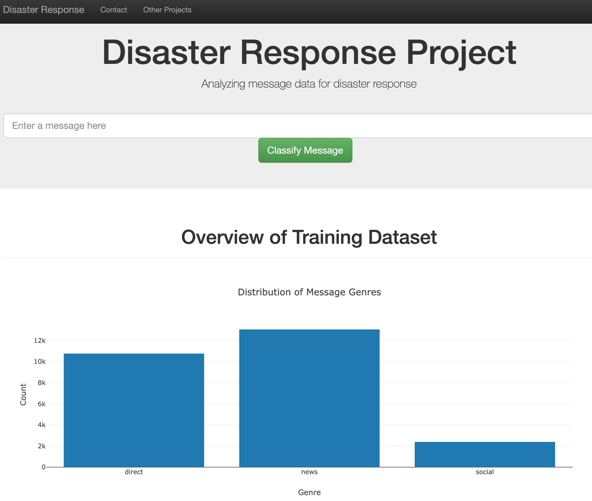

# Disaster Response Pipeline Project

<h2>Table of Contents</h2>

1. Description
2. Getting started
   1. Dependencies
   2. Instructions
3. Deployment
4. Authors
5. Acknowledgements

---------------------------------------------------------

<h4>Description</h4>

This is a project that uses data provided by Figure Eight. The goal of the project is analyze the disaster data from Figure Eight to build a model that classifies disaster messages. The dataset  contains real messages that were sent during disaster events. The project has a machine learning pipeline to categorize these events so that a new message can be classified to an appropriate disaster relief agency.

A web app is also created where an emergency worker can input a new message and get classification results in several categories. The web app also displays visualizations of the data.

___________________

<h3>Getting started</h3>

<h4>Dependencies</h4>

* Python 3
* ML libraries: Numpy, Pandas, Scikit-Learn
* NLP libraries: NLTK
* SQLite database: SQLalchemy
* Pickle
* Web app and Visualization: Flask, Plotly
* Delopyment: Heroku

<h3>Instructions</h3>

1. Clone the git repo:

   `git clone git@github.com:junfang219/disaster_response_pipeline_project.git`

2. Run the following commands in the project's root directory to set up your database and model.

   * To run ETL pipeline that cleans data and stores in database
     `python data/process_data.py data/disaster_messages.csv data/disaster_categories.csv data/disaster_response.db`
   * To run ML pipeline that trains classifier and saves
     `python models/train_classifier.py data/disaster_response.db models/classifier.pkl`

3. Run the following command in the app's directory to run your web app.
   `python run.py`

4. Go to http://0.0.0.0:3001/

<h3>Deployment</h3>

This app is also using Heroku, below is the URL:

https://message-classification.herokuapp.com/

----------------------------------------------------

<h3>Author</h3>

Jun Fang

--------------------------------------------------------------

<h3>Acknowledgements</h3>

* Udacity for providing the project
* Figure Eight for providing the labeled dataset
